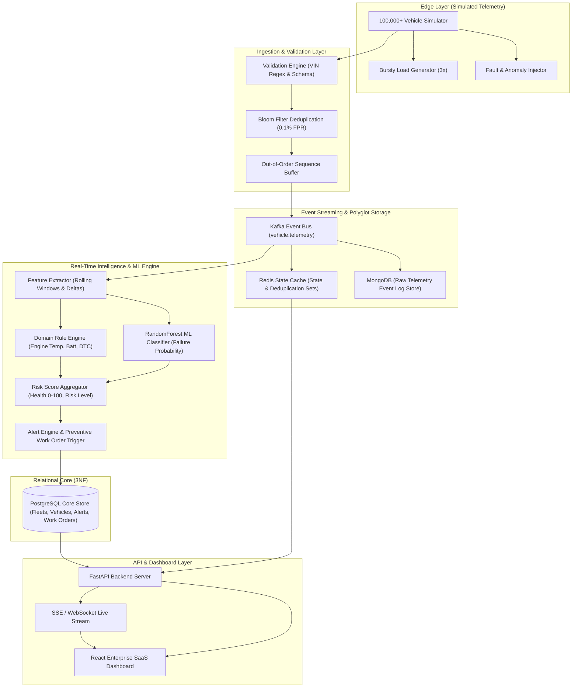
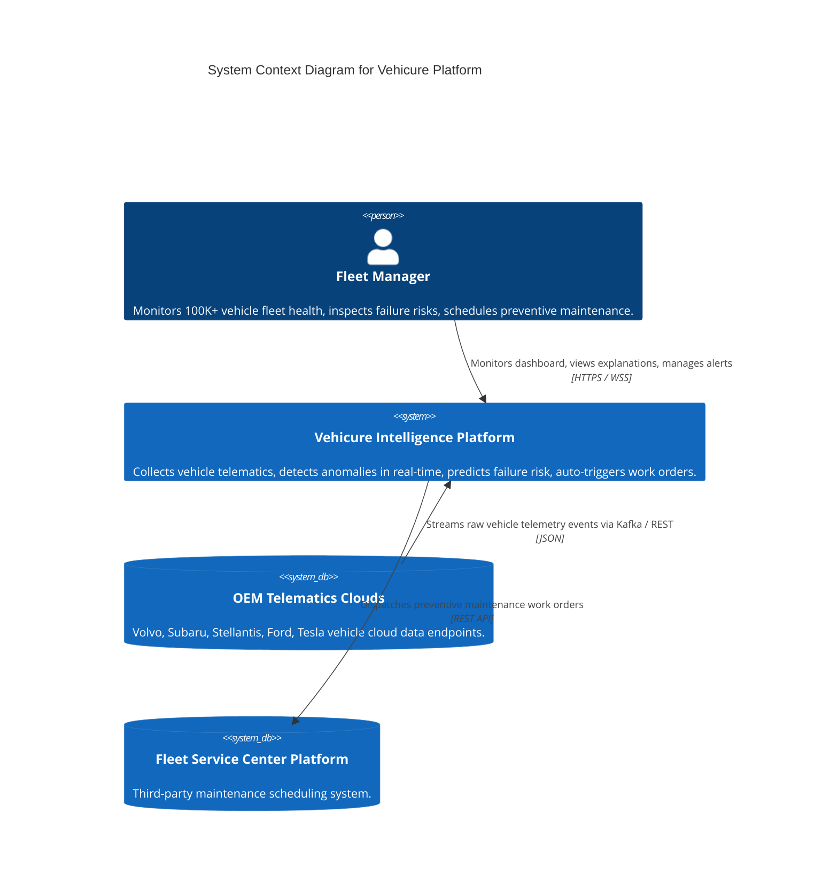
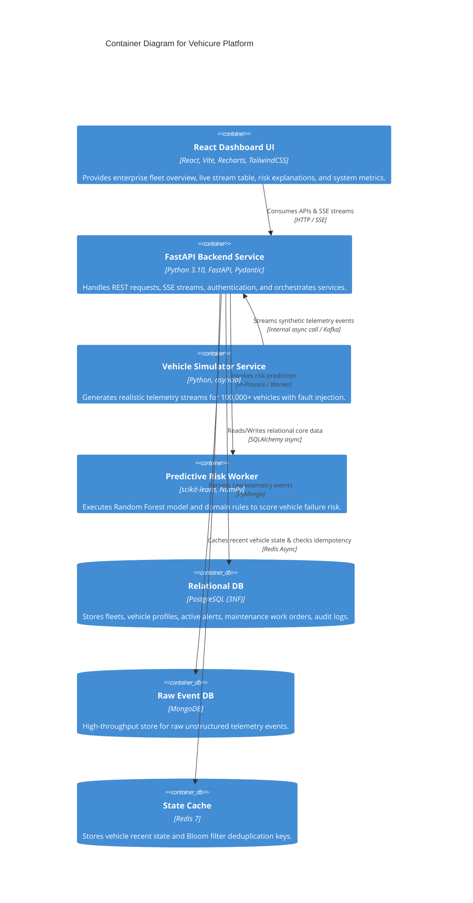
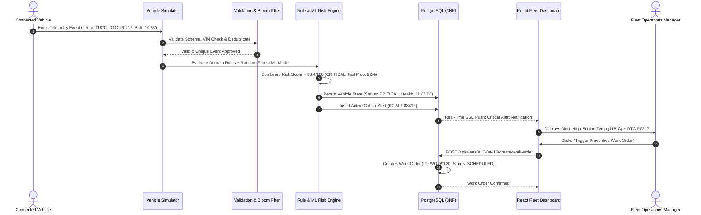

# Architecture Documentation: Vehicure Platform

This document details the system design, C4 architecture models, data flow pipelines, and deployment topology for the **Vehicure** Connected Vehicle Intelligence Platform.

---

## 1. System Architecture Diagram

---

## 2. C4 Context Diagram

---

## 3. C4 Container Diagram

---

## 4. Sequence Diagram: Anomaly Detection to Preventive Work Order

