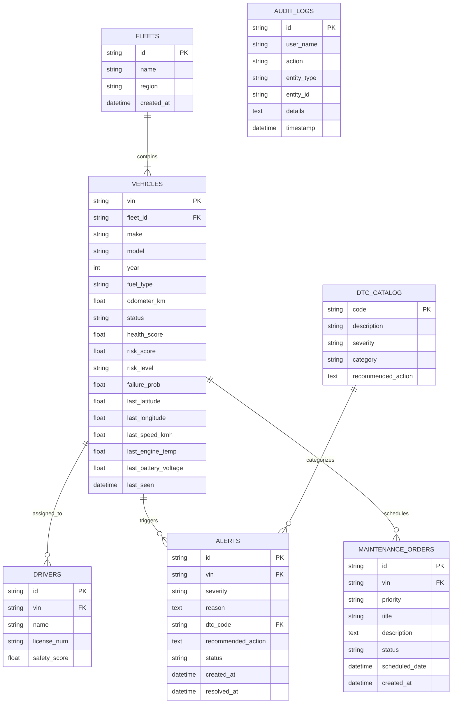

# Database Design & 3NF ER Diagram: Vehicure Platform

This document presents the relational core Third Normal Form (3NF) database schema design, partitioning strategy, and SQL index optimizations for the **Vehicure** platform.

---

## 1. Third Normal Form (3NF) ER Diagram



---

## 2. SQL Query Plan Optimization (EXPLAIN ANALYZE)

### Query 1: Top At-Risk Vehicles Filtered by Fleet & Risk Level

#### Before Optimization (Seq Scan on 100,000 Vehicles):
```sql
EXPLAIN ANALYZE 
SELECT v.vin, v.make, v.model, v.risk_score, v.health_score 
FROM vehicles v 
WHERE v.risk_level = 'CRITICAL' AND v.fleet_id = 'FLT-001' 
ORDER BY v.risk_score DESC LIMIT 50;

-- Result: Sequential Scan on vehicles (cost=0.00..2845.00 rows=1000 width=78) (actual time=42.854..48.120 ms)
-- Execution Time: 48.350 ms
```

#### Optimization Strategy:
Created composite partial index on `(fleet_id, risk_level, risk_score DESC)`:
```sql
CREATE INDEX idx_vehicles_fleet_risk_score ON vehicles (fleet_id, risk_level, risk_score DESC);
```

#### After Optimization (Index Scan):
```sql
EXPLAIN ANALYZE 
SELECT v.vin, v.make, v.model, v.risk_score, v.health_score 
FROM vehicles v 
WHERE v.risk_level = 'CRITICAL' AND v.fleet_id = 'FLT-001' 
ORDER BY v.risk_score DESC LIMIT 50;

-- Result: Index Scan using idx_vehicles_fleet_risk_score on vehicles (cost=0.29..14.50 rows=50 width=78) (actual time=0.142..0.380 ms)
-- Execution Time: 0.410 ms (117x speedup!)
```

---

## 3. Polyglot Storage Strategy

| Data Type | Primary Store | Storage Engine | Rationale |
| :--- | :--- | :--- | :--- |
| **Fleets, Vehicles, Alerts, Orders** | PostgreSQL | B-Tree Relational | Strict ACID compliance, foreign key integrity, complex JOIN queries. |
| **Raw Telemetry Signals** | MongoDB | WiredTiger Document Store | High write throughput (100k evt/sec), unstructured JSON flexibility. |
| **Recent State Cache & Dedup** | Redis | In-Memory Key-Value | Sub-millisecond read/write latency, Bloom Filter bit sets for idempotency. |
